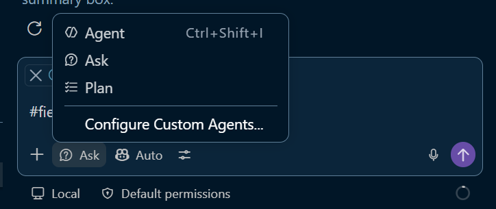
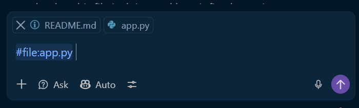
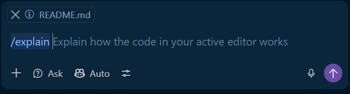

# GitHub Copilot Tutorial : Spotify Dashboard

An interactive, not-very-good-yet Spotify dashboard built with **Plotly Express**. You will use Copilot to explore the codebase, understand how it works, and improve it.

---

## Introduction

### Copilot Modes / Selecting an Agent

Copilot can operate in different modes depending on the kind of help you need. Understanding the difference between these modes helps you choose the right workflow for a task and avoid giving Copilot too much or too little autonomy.

#### Agent, Ask, and Plan modes

- **Agent Agent** is best when you want Copilot to take action across files, make code changes, run commands, and work through a task with minimal back-and-forth.
- **Ask Agent** is best for quick questions and explanations. It behaves more like a conversational assistant and is useful when you want to understand code, debug an error, or learn the best approach before changing anything.
- **Plan Agent** is best when you want Copilot to think through a task before making changes. It helps you outline the steps, identify files to touch, and confirm the approach before implementation begins.

> These different modes are an agent is essentially a combination of instructions and tools. In practice, the agent you select determines how Copilot behaves.

---

### Copilot Commands

- **`#` (context)** — attaches something to your message so Copilot has more information to work with. Think of it as _giving Copilot something to read_. Examples: `#codebase`, `#file`, `#selection`.

- **`/` (commands)** — tells Copilot _what to do_. It triggers a specific action. Examples: `/explain`, `/fix`, `/tests`.

> **Why use `/explain` instead of just typing "explain this"?** According to the GitHub Copilot docs, slash commands exist to _"avoid writing complex prompts for common scenarios."_ `/explain` is a predefined shortcut — Copilot knows exactly what it means, what context to use (your current selection or open file), and how to format the response. It's more reliable and faster than natural language for tasks you do repeatedly.

You can combine them: `/explain #file:visualization.py` means "explain the contents of this file".

---

## Task 1: Have Copilot guide you through running the app

Before making any changes, it helps to understand what the project is supposed to do. In this task, you will use Copilot to identify the entry point, install any dependencies, run the app, and confirm that the dashboard renders correctly.

> **Lab task:** Use Copilot to figure out how to run this project.
>
> Open Copilot Chat and ask something like:
>
> `#codebase what is the entry point of this project? What do I need to install, how do I run it, and what should I see if it is working correctly?`
>
> Copilot will tell you which file to run, what command to use, and what to expect as output.
>
> **Also try:** Use `@terminal` to find out what command to run in the terminal.
>
> `@terminal how do I run this project?`

## ✅ Checkpoint — Ensure you can run the app and view the dashboard.

---

## Task 2: Explore the Codebase Structure with Copilot

Now that the app is running, the next step is to understand how the project is structured and how the code fits together. In this task, you will use Copilot to map the repository and explain the purpose of the main files.

Set your Copilot to Ask mode. Try these in the **Copilot Chat** panel (`Ctrl+Shift+I`):

| Copilot feature | How to use it                               | Try asking...                                             |
| --------------- | ------------------------------------------- | --------------------------------------------------------- |
| `#codebase`     | Includes your **entire project** as context | `#codebase explain the overall structure of this project` |
| `#file`         | Attaches a specific file as context         | `#file:data_loader.py what does this module do?`          |
| `/explain`      | Explains **selected code** in the editor    | Select a function, then type `/explain` in chat           |
| Inline chat     | Opens chat **at your cursor** in the file   | Press `Ctrl+I` inside any file                            |

> **Lab task:** Use `#codebase` to explore the project, then use Copilot to write the **Project Structure** section below.
>
> Try this prompt:
>
> `#codebase generate a markdown project structure tree for this repo with a one-line description for each file`

## ✅ Checkpoint — Confirm that you can explain the purpose of the main files and how they fit together in the project.

---

## Task 3: Explaining the Code

Once the project structure is clear, the next step is to understand how the code works internally. Copilot can help you trace the data flow, explain functions, and show how the files connect to one another.

### Lab: Explain the Code

> Take some time to explore the code using Copilot. Use `/explain` on selected code, `#file` in Chat, or `Ctrl+I` for inline explanations.
>
> Use Copilot to answer these questions:
>
> **Packages**
>
> - What does each package do, and which part of the app would break without it?
>
> **How the files relate**
>
> - How does `app.py` get access to the functions in `data_loader.py` and `visualization.py`?
> - If you wanted to add a new chart, which file would you edit — and what changes would be needed in the others?

## ✅ Checkpoint — Discuss any parts of the code that were unfamiliar and confirm that you understand how the app is structured.

---

## Task 4: Improve the Application with Copilot

Once the app is running and the code structure is clear, the next step is to improve the actual user experience. The current visualisations are functional, but they do not always follow strong data visualisation principles: some charts may be cluttered, difficult to interpret, or poorly matched to the story the data is trying to tell. This is a good opportunity to use Copilot to critique and redesign the visuals in a more thoughtful, user-friendly way.

### Lab: Develop the Application

> Use Copilot to generate better Plotly charts by writing clear, descriptive prompts to develop the code.
>
> You can try a few different approaches:
>
> - Write a comment in the file describing the chart you want, then let Copilot generate the code underneath it.
> - Use the inline code suggestions in the editor to accept small, targeted completions while you are editing the visualisation code.
> - Open a chat in Agent mode and ask Copilot to implement a specific chart or improvement across the relevant files.
>
> Try experimenting with each of these approaches and compare the results.

## ✅ Checkpoint — Reflect on which approach produced the clearest improvement and how the visualisations became easier to interpret.

---

## Task 5: Repository-Wide Copilot Instructions

GitHub Copilot supports a special file — `.github/copilot-instructions.md` — that lets you give Copilot persistent, repository-wide guidance. Any natural language instructions you write there are **automatically included in every Copilot request** made in the context of this repo, without you needing to repeat them in every prompt.

Repository-wide instructions are especially useful in team settings where consistent quality, security, and documentation standards matter. They help ensure that Copilot responds with the same conventions across every file and every developer prompt.

### Specify a Docstring Convention

In a data science team, repository-wide Copilot instructions are a practical way to enforce shared standards without relying on every code contributer to remember them. For example, a team might add instructions like:

- **Docstring format:** "All functions must include a NumPy-style docstring with `Parameters`, `Returns`, and `Raises` sections."
- **Security:** "Never suggest hardcoded credentials, connection strings, or API keys — always use environment variables or a secrets manager."
- **Compliance:** "Any function that trains or scores a model must include a docstring referencing its intended regulatory scope, such as IFRS 9, Basel III, or model governance controls."
- **Data handling:** "Never log raw customer or transaction data. Always mask or redact personally identifiable information before writing to logs or console output."

> **Lab task:** Create a Copilot instructions file that enforces a docstring style.
>
> 1. Click the settings icon in the top right of the Copilot Chat panel, select **Instructions**, then click **Generate Instructions**. Alternatively, start a chat with `/create-instructions`.
> 2. When prompted, instruct Copilot to enforce that every new function has a docstring that says `"[your-name] wuz here"`.
> 3. Check the `.github` folder to confirm that your instructions file has been created.
> 4. Create a new function using Copilot, then type `"""` under the function definition to start a docstring.
>
> **Reflection:** Has the instructions file altered the behavior of Copilot?

## ✅ Checkpoint — Confirm that the repository instructions file exists and that Copilot is now applying those standards to new code suggestions.
